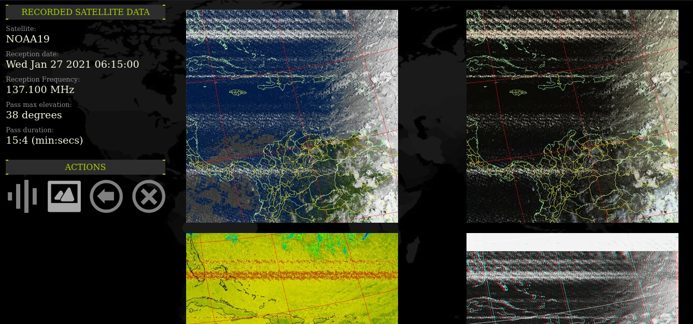

# Fully Automatic Amateur Satellite Ground Station

A setup to build an amateur satellite ground stations that can tune, record and generate images for APT weather satellites and record audio from Amateur ones.

This is the software recipe, in the hardware part I used an [Orange Pi Prime Board](http://www.orangepi.org/OrangePiPrime/) (Similar to Raspi 3B+) with [Armbian](https://www.armbian.com/) but you can use any [Single Board Computer](https://en.wikipedia.org/wiki/Single-board_computer), including Raspberry Pis, O-droids and even a normal PC or Server.

The only advice is to use one with a multiple cores and at least 1GB of RAM as some task are resource intensive.

A sample of the main view:


A sample view of a pass of PO-101 DIWATA-2B (FM sat):


A sample view of a pass of a NOAA weather APT satellite:



## Inspiration

This project is inspired and heavily based on the work of [Luick Klippel](https://github.com/luickk) and his work on his [NOAA Satellite Station](https://github.com/luickk/noaa_satellite_ground_station) repository.

## Features

- Web interface to see the next passes, the recorded ones, and details for it.
- Receive any satellite in FM mode *(no SSB by now, as we can't do doppler correction yet)*
- Record the satellite pass and keep the audio for later.
  - APT WX audio is preserved in wav format and 22050 hz of sampling *(the format [wximage](https://wxtoimgrestored.xyz/) needs to work with)*
  - FM audio satellites is preserved in .mp3 mode but with high quality settings, and other tricks:
    - The spectrogram of the audio is embedded as album art *(see below)*.
    - The pass details and receiving station data are stored in the mp3 tags.
- Automatic decode APT images from WX sats (NOAA 15, 18 and 19)
- For the voice FM sats we craft a spectrogram and embed the metadata of the pass on the image.
- **NEW** selection for audio processing schema: streamed or step by step (first is good on fast or dedicated systems, the former on slow or multitasking ones) see users.conf while installing for more details.

## Future features?

- Rotor control via [Hamlib](https://hamlib.github.io/).
- Doppler control to allow for SSB/CW. 
- New UI (web) to allow for user authentication, etc.

## Installation steps

 **Warning:** all the installation steps mentioned here need root privileges, typically just making a `sudo -i` in the console to gain root is enough, or you can type `sudo` before any command.

### pre-installation requisites

As this tool relies on many tools I will not explain how to setup each one, but I will give you clues of where to get info about it.

- **Web server + PHP support**

You need a web server with php installed (at least version 7.x, no MySQL or MariaDB support needed), google has a lot of guides indexed, just google for "install nginx and php in [your-operating-system]"

**RaspiOS/Raspbian users**: If the web server works but does not process php files (try to download the index.php file instead of process & show) you must take a peek on this [tutorial](https://www.raspberrypi.org/documentation/remote-access/web-server/nginx.md) about how to enable php support for nginx.

- **Predict**

You need to install `predict` the software to make predictions of satellite passes.

For **RaspiOS / Raspbian**:

```sh
sudo apt install predict
```

For Armbian you need to compile it from source, you can get it from the [Predict home page](https://www.qsl.net/kd2bd/predict.html).

After installing predict you need to do this additional steps to make it run properly (install some files):

```sh
sudo -i
mkdir /root/.predict
cd /root/.predict
wget https://raw.githubusercontent.com/kd2bd/predict/master/default/predict.db
wget https://raw.githubusercontent.com/kd2bd/predict/master/default/predict.tle
wget https://raw.githubusercontent.com/kd2bd/predict/master/default/predict.qth
# Next step only if using a Rasberry Pi board
ln -s /root/.predict /home/pi/.predict
```

- **WXtoImage**

This wonderful piece of software was deprecated by the original authors but a group of enthusiast keep it alive in the [Restored WXtoImage](https://wxtoimgrestored.xyz/) site.

Just download it here: [WXtoImage deb package for ARM](https://www.wxtoimgrestored.xyz/beta/wxtoimg-armhf-2.11.2-beta.deb) or browse the site for other architectures.

To install it copy it to your SBC computer and run (Debian based distribution):

```sh
sudo dpkg -i wxtoimg-armhf-2.11.2-beta.deb
# [ignore errors if any]
sudo aptitude install -f
# [this will fix any dependency error listed above]
```

As I mention this software is abandon-ware and if you search on the site you will find a generic register credentials.

To register the software in the SBC you need to install it on a linux box with an GUI (can be another SBC or a real linux box); run xwximage and fill your coordinates and settings, register with the credentials and just then locate a hidden file under your home directory called `.wxtoimgrc` and copy it to `/root/.wxtoimgrc` in the SBC. You are done.

- **Utilities**

You need at least `git` and `make`, in most linux (including SBCs) you are set by running this:

```sh
sudo apt install git make
```

## Real install

- Login in your into SBC and clone this repository `git clone https://github.com/stdevPavelmc/FAASGS`.
- Change to the created folder `cd FAASGS`.
- Gain root access via `sudo -i`
- Run configuration steps `make cconf`.
- Configure your local data (see [Configuring](#configuring) below)
- Run install script `make install`.
- Execute it by hand to check if all works `sats.sh`.
  -  Go to your IP address and check if there is any 'next pass' scheduled.
- If all gone ok, run the schedule script to make it run for good `make permanent`

## Configuring

After the configure step you need to modify your local data, you callsign (use N0NAME if you are not a ham radio operator), name, locator (use [this tool](https://www.iz3mez.it/maps.google/ww-loc.html) if you are in doubt), coordinates (use locator tool to check the coordinates too), QTH and the satellites you want to capture.

Just go to `/etc/sat_data` and edit a file named `user.conf` with the command `sudo nano user.conf` to fill your data.

You will find a proxy setting there to, if you don't use a proxy just leave it as is, if you use a proxy then follow the comments.

Next step is to select the satellites you want to monitor, the file is named `sats.json` and it has a very common web format, you can add or remove sats as your need.

Use `sudo nano sats.json` to edit the file, it came by default with all the working NOAA satellites and the working VHF ones, but if you have a dual-band antenna you can introduce some UHF sats also.

Please note that the satellites has a name and a nickname, the name refers to the one that appears in the TLE file and the nickname is a friendly name for us (and must not contain spaces, parenthesis, slashes, etc)

## Upgrading

This software is designed to be upgradeable with little efforts, just follow this steps:

- Login into your SBC and change to the folder you cloned the repository in the past.
- Gain root access via `sudo -i`
- Update the software with this command `git pull` if there is an update you will be notified about the files that has changed.
  - If you get a warning about it can merge the data, just do this `git reset --hard` tha twill reset the tree then repeat the `git pull`. 
- Clean the workspace with this command `make clean`
- Make a backup of your user settings `cp /etc/sat_data/user.conf ~/`
- Install the new version of the software `make install`.
- Review and update the file `/etc/sat_data/user.conf` from your backup in `~/user.conf`, Some times new options are added, if you simply overwrite the new with the old you may lose the new options)
- Test it run on the console `sats.sh` and you must see the shcedule for upcomming passes.
- Make it permanent with `make permanent`.

## Removing

If you need to remove the software there is a command for that `make remove`, but all the collected data will be preserved in the `/var/www/html/sat` folder, you will be warned about it.

## A word about the RF part: Antennas!

I have not spoken about antennas and RF in this document because that relies on your expertice, I will mentioned my experience with some and I trust your internet skills to find them

- A 2m J-pole: normal for voice FM sats, bad for APT images (the image of PO-101 above was taken with just a  J-pole + 12m of RG-8X)
- A horizontal 120 degrees V for APT satellites (137 Mhz): better for APT, regular-to-bad for voice FM satellites
- A 1/4 wave 2m ground plane (120 degrees elements) regular for 2m voice, regular for APT and regular-good for 70cm sats (yes, it works on 70cm too)
- The mentioned V + a custom VHF wide LNA (about +8 dB on 137 and 145 Mhz): very good for APT, normal-to-good for voice FM sats *(actual antenna I'm using now)*

As usual, the higher and un-obstructed view for the antenna the better, also for coax: top quality ones and as short as possible.

## RTL-SDR Calibration

Almost all RTL-SDR dongles has a clock source deviation from the desired frequency (even the ones that advertise a TXCO with `0,5 ppm error`, it's small but is there), that deviation is measured in ppm (parts per million) and is particular of each device.

The FM mode (mostly used for now) is not very picky with an error of a few kHz (and we have doppler that drift the signal continuously), but as many of you may want to use the ppm correction there is an option in the `user.conf` file to set your device ppm error.

### How to calculate the ppm error of my RTL-SDR?

There is a few good sources of info out there, here list some of them:

- Get ballpark values with [this method](https://davidnelson.me/?p=371), let it run for a few minutes and left the PC alone, use the value after `cumulative PPM:`
- Calculate it manually against a FM commercial station in the 88-108 MHz band, see [this video](https://www.youtube.com/watch?v=gFXMbr1dgng), pick one with people chatting as you will see the center peak better; that will give you a best that a ballpark value.
- Get a very accurate measurement by using [this extra tool](http://www.satsignal.eu/raspberry-pi/acars-decoder.html), seek to the **Using Kalibrate** and follow the instructions for Linux or Windows.

## This is FREE SOFTWARE!

Free as in freedom, no payment are needed, see the LICENCE file for details.

If this is software is of any utility to you; please consider to make a donation to keep me improving it, see [Contributing](Contributing.md) file for details.

## Contributing

You can improve the software, appoint bugs or fails, donate equipment or money, top up my cell phone, or just share your impressions on social media; details for all of that in the [Contributing](Contributing.md) file.

Any kind of contribution is welcomed.
