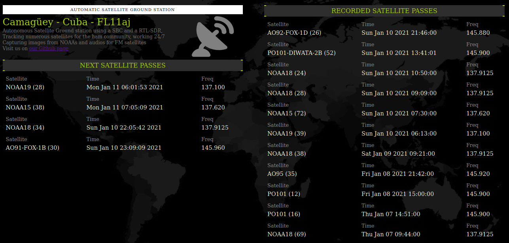
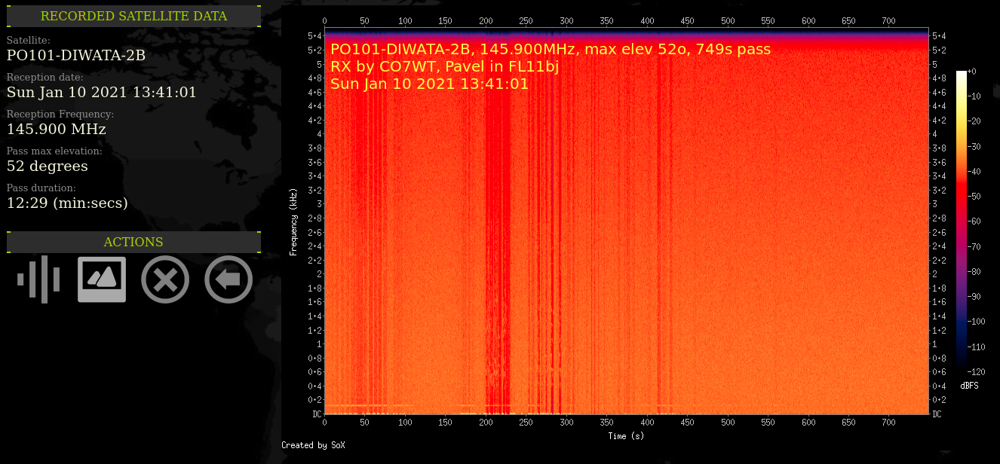

# Fully Automatic Amateur Satellite Ground Station

A setup to build a satellite ground stations that can tune, record and generate images for FM and APT weather satellites. This is the software recipe, in the hardware part I used an [Orange Pi Prime Board](http://www.orangepi.org/OrangePiPrime/) but you can use any [Single Board Computer](https://en.wikipedia.org/wiki/Single-board_computer), including Raspberry Pis, O-droids, etc. The only advice is to use a medium power one (multi core and at least 1GB of RAM)

I used [Armbian](https://www.armbian.com/) as OS, but you can manage it to make it work with [RaspiOS](https://www.raspberrypi.org/software/) with a little work.

A sample of the main view:



A sample view of a pass (PO-101 DIWATA-2B FM sat):



## Inspiration

This proyect is inspired and heavily based on the work of [Luick Klippel](https://github.com/luickk) and his work on his [NOAA Satellite Station](https://github.com/luickk/noaa_satellite_ground_station) repository.

## Features

- Web interface to see the next passes, the recorded ones, and details for it.
- Receive any satellite in FM mode *(SSB is possible but no there is doppler control yet, so no SSB by now)*
- Record the satellite pass and keep the audio for later.
  - APT WX audio is preserved in wav format and 22050 hz of sampling *(the format [wximage](https://wxtoimgrestored.xyz/) needs to work with)*
  - FM audio satellites is preserved in .mp3 mode but with high quality settings, and other tricks.
    - The spectrogram of the audio is embedded as album art *(see below)*.
    - The pass data and receiving station are stored in the mp3 tags.
- Automatic decode APT images from WX sats (NOAA 15, 18 and 19)
- For the voice FM sats we craft a spectrogram and embedd the metadata of the pass on the image

## Planed features

- Migrate to python3 for the main processing.
- Control a rotor via [Hamlib](https://hamlib.github.io/).
- Craft a solution to allow for doppler corrections while receiving *(will allow to receive SSB signals, at least for CW beacons)*
- Any other.

## Installation

### pre-installation requisites

As this tool relies on many tools I will not explain how to setup each one, but I will give you clues of where to get info about it.

- **Web server + PHP support**

You need a web server with php 7.x support installed (no MySQL or MariaDB support needed), google has a lot of guides indexed, just google for "install nginx and php in [your-operating-system]"

- **Predict**

You need to install `predict` the software to make predictions of satellite passes.

For **RaspiOS / Raspbian**:

```sh
sudo apt install predict
```

For Armbian you need to compile it from source, you can get it from the [Predict home page](https://www.qsl.net/kd2bd/predict.html).

- **WXtoImage**

This wonderful piece of software was deprecated by the original authors but a group of enthusiast keep it alive in the [Restored WXtoImage](https://wxtoimgrestored.xyz/) site.

Just download it here: [WXtoImage deb package for ARM](https://www.wxtoimgrestored.xyz/beta/wxtoimg-armhf-2.11.2-beta.deb)

To install it copy it to your SBC computer and run:

```sh
sudo dpkg -i wxtoimg-armhf-2.11.2-beta.deb
# [ignore errors if any]
sudo aptitude install -f
# [this will fix any dependency error]
```

To register the software in the SBC you need to install it on a linux box (can be another SBC or another real linux box); then fill your coordinates and settings, register with the credentials and just then locate a hidden file under your home directory called `.wxtoimgrc` and copy it to `/root/.wxtoimgrc` in the SBC. You are done.

- **Utilities**

You need at least `git` and `make`, in most linux (including SBCs) you are set by running this:

```sh
sudo apt install git make
```

### This software installation

- Login in your into SBC and clone this repository `git clone https://github.com/stdevPavelmc/FAASGS`.
- Run install script `make install`.
- Configure your local data (see [Configuring](#configuring) below)
- Execute it by hand to check if all works `sats.sh`.
  -  Go to your IP address and check if there is any 'next pass' scheduled.
- If all gone ok, run the schedule script to make it run for good `make permanent`

## Configuring

After the install step you need to configure your local data, you callsign (use N0NAME if you are not a ham radio operator), name, locator (use [this tool](https://www.iz3mez.it/maps.google/ww-loc.html) if you are in doubt), coordinates (use locator tool to check the coordinates too), QTH and the satellites you want to capture.

Just go to `/etc/sat_data` and edit a file named `user.conf` with the command `nano user.conf`. You will find a proxy tsetting there to, if you don't use a proxy just remove or comment it.

Next step is to select the satellites you want to monitor, the file is named `sats.json` and it has a very common web format, you can add or remove sats as your need.

Please note that the satellites has a name and a nickname, the name reffers to the one that appears in the TLE file and the nickname is a friendly name for us (and must not contain spaces, parenthesis, slashes, etc)

## Contributing

You can improve the software, donate equipment, top up my cell phone, or kust share your impressions on social media; all of that in the [Contributing](Contributing.md) file.

## This is FREE SOFTWARE!

Free as in freedom, see the LICENCE file for details.